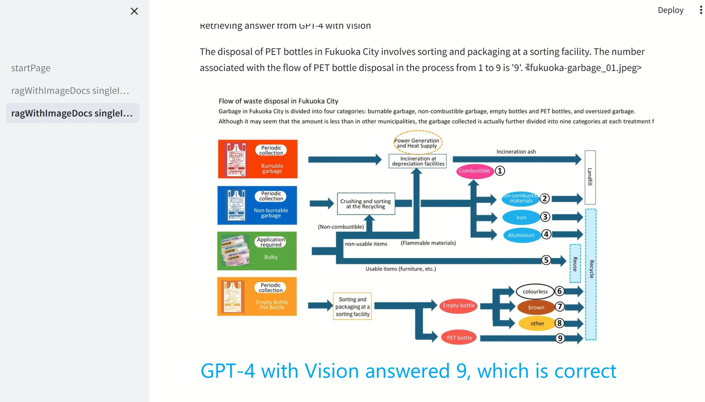

<h1>GPT-4 with Vision assists RAG pattern for Procedural Documents</h1>

Download poppler from [poppler-windows](https://github.com/oschwartz10612/poppler-windows/releases) for Windows Users

Configuration
1. Put your pdf files in PDF folder
2. Run noteboooks staring 01 through 04
3. Change directory to streamlit then run "streamlit run startPage.py"
4. Use "ragWithImageDocs_singleImage_withGpt4Hint"
 
 
 
 
 

